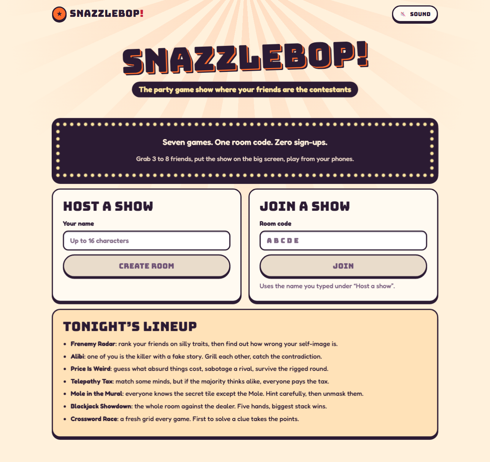
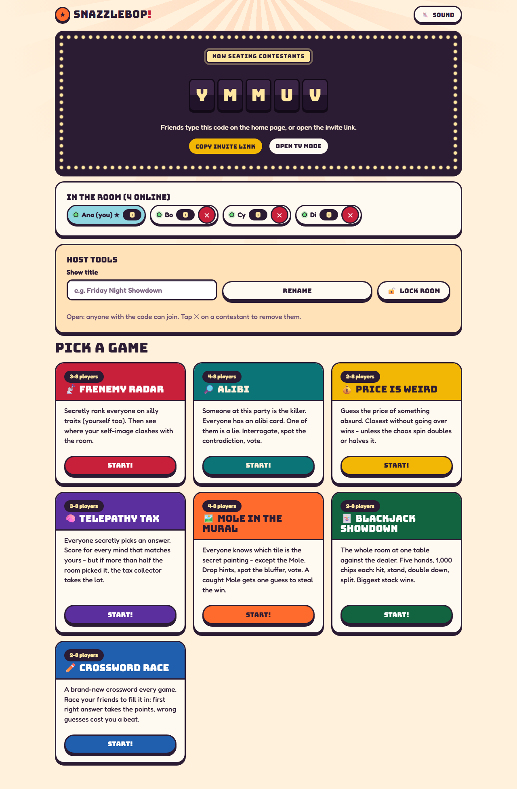
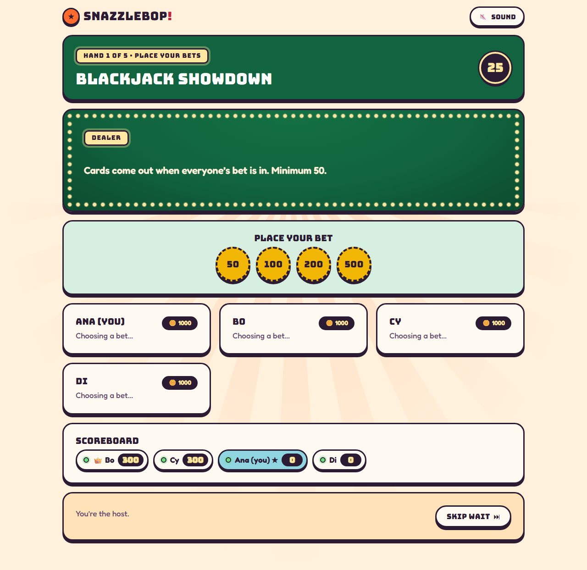
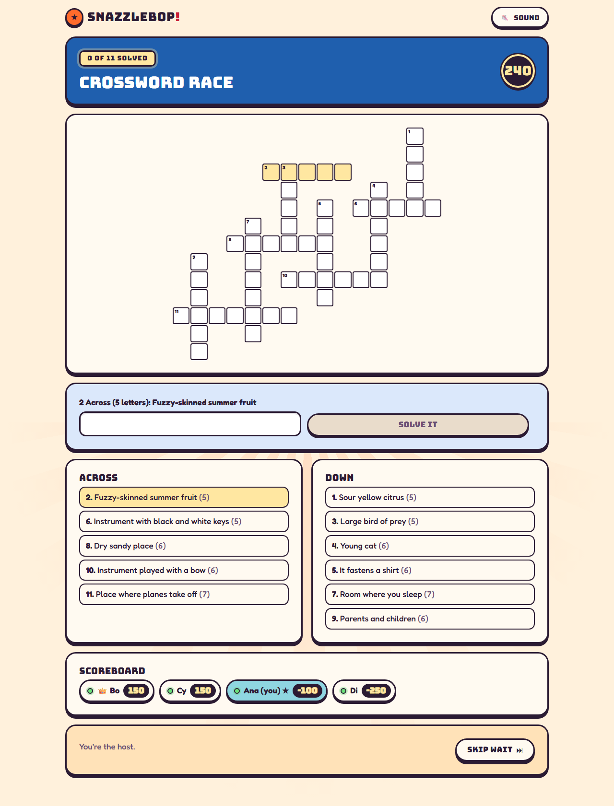
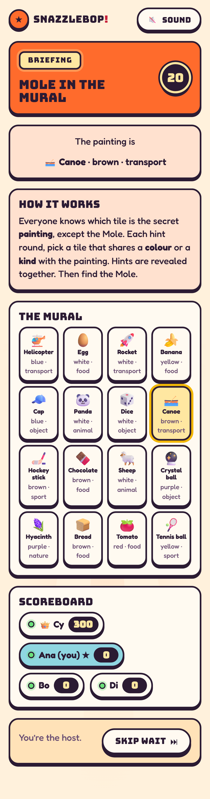
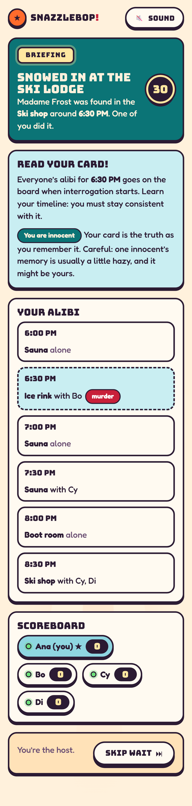
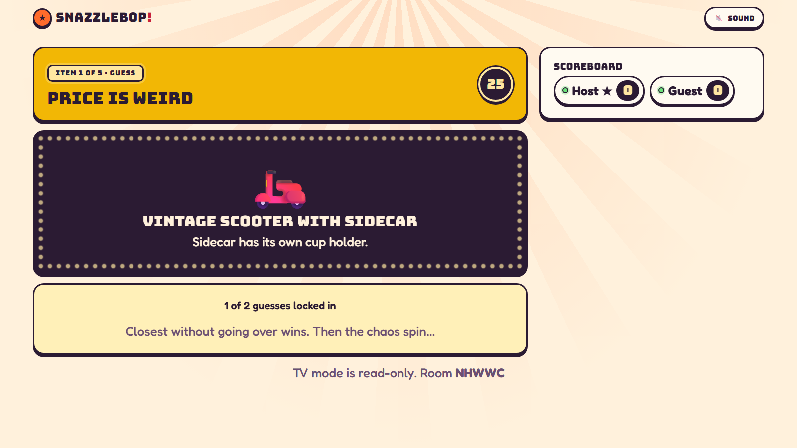

# Snazzlebop!

The party game show where your friends are the contestants. 1-8 players (plus an audience), one room code, no sign-up.
Put the show on a TV, play from your phones.

**Live:** https://snazzlebop.onrender.com



| Game | Players | What happens |
| --- | --- | --- |
| **Frenemy Radar** | 3-8 | Secretly rank everyone (yourself too) on flattering traits; see your *blind spot*. Guess where the room puts you (mirror check). Finale: total frenemies, mutual fans, a shareable card. |
| **Alibi** | 4-8 | A killer with a partly fake alibi hides among innocents. Grill each other, watch contradictions light up, one **Objection!** each, and the killer can plant one fake camera clue. Vote. |
| **Price Is Weird** | 2-8 | Closest guess without going over wins, then the sealed chaos spin. Sabotage, a rigged round, price duels between items, and a 3-prize **Showcase** with double or nothing. |
| **Telepathy Tax** | 3-8 | Score for every mind that matches yours, unless over half the room does (taxed!). Streak bonuses and a contrarian round. |
| **Mole in the Mural** | 4-8 | Everyone knows the secret tile except the Mole (two Moles at 7-8). Hint by colour or kind, spot the bluffer; Moles get one sneaky hint **Switcheroo**. |
| **Blackjack Showdown** | 1-8 | Solo or the whole room against the dealer: split, double, side bets on friends, a secret **Chaos hand**, and a knockout tournament mode. |
| **Crossword Race** | 2-8 | A fresh grid every game. First right answer takes the clue; buy a private letter; or play in two teams. |
| **Liar's Dice** | 2-8 | Secret dice, public bids on the whole table (ones wild). Raise, call **Liar!** or **Spot on!** Down to your last die? A **Palifico** round. Last one rolling wins. |
| **Split or Steal** | 2-8 | Paired every round over a pot: both split, share; one steals, they take it; both steal, nobody does. Trash talk first, public records, and a **Golden Pot** finale with everyone in. |
| **Chicken Run** | 2-8 | The pot climbs every second; cash out before the hidden bomb goes off. Buy insurance, or shorten a rival's fuse. |
| **Wager Wits** | 2-8 | Answer a number question, then bet chips on whose answer is closest without going over. The last question is **all in**. |
| **Code Crackers** | 2-8 | Hide a 4-fruit code, then race to crack everyone else's with Mastermind clues. Buy hints; arm a decoy. |
| **Roulette Royale** | 3-8 | Bet on the wheel while one of you is secretly the House, winning what the table loses. The House can rig one spin; call an **audit**. |
| **Lowest Lonely Number** | 2-8 | Everyone secretly picks 1-20; the lowest number nobody else picked takes the pot. Nobody lonely? It rolls over. |
| **Codewords** (team game) | 4-8 | Red vs Blue over 25 words. Spymasters give one-word clues, guessers mark and reveal, and nobody touches the assassin. Played on its own from the lobby's Team games, not in show nights. |
| **Mystery Box Auction** | 3-8 | Six sealed boxes (prizes, a dud, two bombs). You peeked inside one; bid live, bluff, and let a friend buy the bomb. |

**Show night.** Pick 2-6 games for one scoreboard: the host's one-liners after every game, a highlight
reel and awards at the finale, an optional **Jackpot** finale (everyone wagers their score on higher or
lower), and themed show packs. Also:

- **Power cards:** one secret card each per show (Double Down, Shield, Steal 50, Peek), revealed at the
  results.
- **Rivals:** every game pairs the closest scores; beat yours for +50.
- **Friend Stock Exchange** (optional): before every game everyone trades shares in each other (long or
  short). Prices move with how people actually do, winners pay dividends, one player gets an insider
  tip, and net worth turns into points at the end.
- **Rematch:** rerun the lineup from the finale; a season table tracks shows won.
- **Audience:** up to 30 more people react, predict winners, trade on the exchange and vote an MVP
  (+50).

| Lobby | Blackjack | Crossword |
| --- | --- | --- |
|  |  |  |

| Mole in the Mural (390 px) | Alibi (390 px) | TV mode |
| --- | --- | --- |
|  |  |  |

Every game opens with a short "how to play" screen that starts once everyone taps Ready, results
screens move on as soon as everyone is ready, and the rules stay one tap away during play.

Also: a dark theme by default ("after hours" neon studio) with a light toggle, TV mode (read-only big-screen view), host tools (rename the show, lock the room, remove a player),
reconnect into the same seat, generated sound effects (off by default), reduced-motion support, and a web app manifest
so phones can add it to the home screen (no service worker: the game needs a live connection anyway).

**Content.** Every game deals from a large pool without repeats inside a room until the pool runs out.
With `ANTHROPIC_API_KEY` set, the server also asks Claude for fresh items when a game starts, validates
and de-duplicates them, stores them, and adds them to the pool. Without a key, or when the API is rate
limited or down, games use the built-in pools as normal.

Backend: FastAPI + WebSockets (Python 3.13). Frontend: Vite + React + TypeScript, hand-written CSS.
One Docker service serves both from the same origin.

- Developer guide and architecture rules: [CLAUDE.md](CLAUDE.md)
- Threat model, controls, limits, launch checklist: [SECURITY.md](SECURITY.md)
- What was actually tested and the results: [docs/SECURITY-EVIDENCE.md](docs/SECURITY-EVIDENCE.md)

## Quick start

```bash
# API
cd backend && python -m venv .venv && source .venv/bin/activate
pip install -r requirements-dev.txt
uvicorn app.main:create_app --factory --reload --port 8000
# UI (new terminal)
cd frontend && npm install && npm run dev      # http://localhost:5173
```

Or the production image: `docker build -t snazzlebop .` then run it with `ENV=production`,
`SECRET_KEY`, `ALLOWED_HOSTS` and `ALLOWED_ORIGINS` (see [.env.example](.env.example)).

## Deploy

1. Push this repo to GitHub.
2. Render → **New → Blueprint** → pick the repo. [render.yaml](render.yaml) creates the web service
   (Docker) and a private Postgres. `SECRET_KEY` is generated; host and origin allowlists come from
   `RENDER_EXTERNAL_HOSTNAME`.
3. Optional: in the service's Environment tab set `ANTHROPIC_API_KEY` for fresh content. It's a
   dashboard secret and never goes in git.
4. Walk the launch checklist in [SECURITY.md](SECURITY.md) against the live URL.

render.yaml uses the Starter plan (always on). The free plan works too, but sleeps when idle and drops live rooms.

### Client IP, Cloudflare and custom domains

Render already sits behind Cloudflare, so render.yaml sets `CLIENT_IP_HEADER=cf-connecting-ip`.
Without it the app rate-limited on a shared Cloudflare edge address that clients could steer with a
forged `X-Forwarded-For`. That was found on the live deploy and fixed (see
[docs/SECURITY-EVIDENCE.md](docs/SECURITY-EVIDENCE.md)). For your own Cloudflare zone and custom
domain, follow "Client IP and Cloudflare" in [SECURITY.md](SECURITY.md).

## What is verified, and what isn't

Run locally on Windows 11 + Docker Desktop against the production image (details and output in
[docs/SECURITY-EVIDENCE.md](docs/SECURITY-EVIDENCE.md)):

- 349 backend tests (engines, `view_for` secrecy per game incl. TV spectators, rate limits, tokens,
  middleware, config rules, content validation), ruff, bandit, pip-audit.
- Simulator: bots play all eighteen games over real WebSockets, scores are recomputed from the rules, and
  no frame ever carries another player's secret.
- Playwright on 390 px and desktop: 26 tests including axe, keyboard, TV mode, host tools, reconnect.
- Locust abuse suite (rate limits, socket caps, oversize/flood closes, slow reader), OWASP ZAP
  baseline, Lighthouse (home 100 a11y/best practices/SEO), colour contrast for every pair.
- Image: Trivy CRITICAL/HIGH (fixable) clean, gitleaks over full history clean.
- CI on GitHub Actions green (backend, frontend, docker incl. Trivy/simulator/Playwright/Lighthouse/ZAP,
  abuse, gitleaks, CodeQL); every action pinned to a commit SHA, read-only default token.

**Not verified yet:**

- Cloudflare: the edge steps are written from documented behaviour and the edge-secret check is tested
  locally, but the hop count has not been checked through a real Cloudflare → Render chain.

**Limits by design:** one instance with in-memory rooms and rate limits (a restart ends live games),
anonymous play (many IPs can make many players), and no external security review or pen test. This is
a strong, evidenced baseline, not a guarantee.
